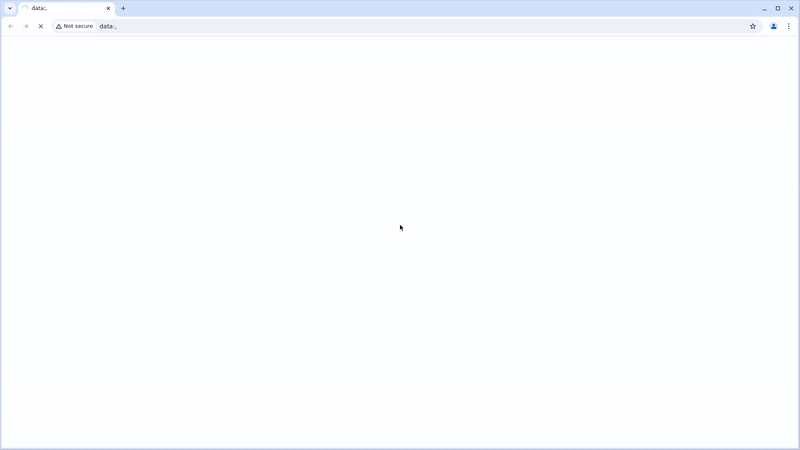

<p align="center">
  <a href="https://kupsilla.com/" target="_blank">
    
  </a>
</p>

# Kupsilla web site automated tests

## 📜 Summary
- [Stack](#-stack)
- [Automated test cases](#-automated-test-cases)
- [Build](#-build)
- [Allure report](#-allure-report)
- [Notifications](#-notifications)

  
## 💻 Stack

<div align="center">
  <table>
    <tr>
      <!-- First row -->
      <td align="center" width="110">
        <a href="https://www.java.com" target="_blank">
          
        </a>
        <br>Java 21
      </td>
      <td align="center" width="110">
        <a href="https://junit.org/junit5/" target="_blank">
          
        </a>
        <br>JUnit 5
      </td>
      <td align="center" width="110">
        <a href="https://gradle.org/" target="_blank">
          
        </a>
        <br>Gradle
      </td>
      <td align="center" width="110">
        <a href="https://selenide.org/" target="_blank">
          
        </a>
        <br>Selenide
      </td>
    </tr>
    <tr>
      <!-- Second row -->
      </td>
      <td align="center" width="110">
        <a href="https://docs.qameta.io/allure/" target="_blank">
          
        </a>
        <br>Allure
      </td>
      <td align="center" width="110">
        <a href="https://www.jenkins.io/" target="_blank">
          
        </a>
        <br>Jenkins
      <td align="center" width="110">
        <a href="https://web.telegram.org/" target="_blank">
          
        </a>
        <br>Telegram
      </td>
    </tr>
  </table>
</div>

- Developed using **Java 21**, **JUnit**, and **Selenide**
- Built via **Gradle**
- Run using **Selenoid** containers
- Integrated build with **Jenkins**
- Sending notifications to **Telegram**

## ✅ Automated test cases
1. Checking the Kupsilla logo
2. Checking that the "Discuss a project" form is shown after clicking in the corresponding button
3. Checking the contacts in the site footer
4. Checking the "About" tab contents
5. Checking the Copyright Information

## ▶️ Build

The build is parametrized. The tests can be run in different browsers, browser versions, resolutions as well as the Seleoid environment can also be configured. 


### Local build

```bash
gradle clean smoke_test
```

### Remote build (Jenkins)

```bash
smoke_test
-Dbrowser=${Browser}
-DselenoidHostName=${SelenoidHostName}
-DselenoidLogin=${SelenoidLogin}
-DselenoidPassword=${SelenoidPassword}
-DbrowserVersion=${BrowserVersion}
-DscreenResolution=${Resolution}
```

##  Allure report

### Allure report page
//TODO: Add the allure report main page image
[Example]()

### Each test in the report contains:
- User-friedly readable test steps
- Screenshot of the last step
- Page Source
- Browser logs
- Video of the test run
  


##  Notifications

After each run a notification is sent automatically to **Telegram** with a brief summary of the test results including the number of passed and failed tests, run duration, and report link. This functianlity is implemented using the [allure-notifications](https://github.com/qa-guru/allure-notifications) library which also allows sending notifications to Slack, Discord, and other messengers.

//TODO: Add screenshot
